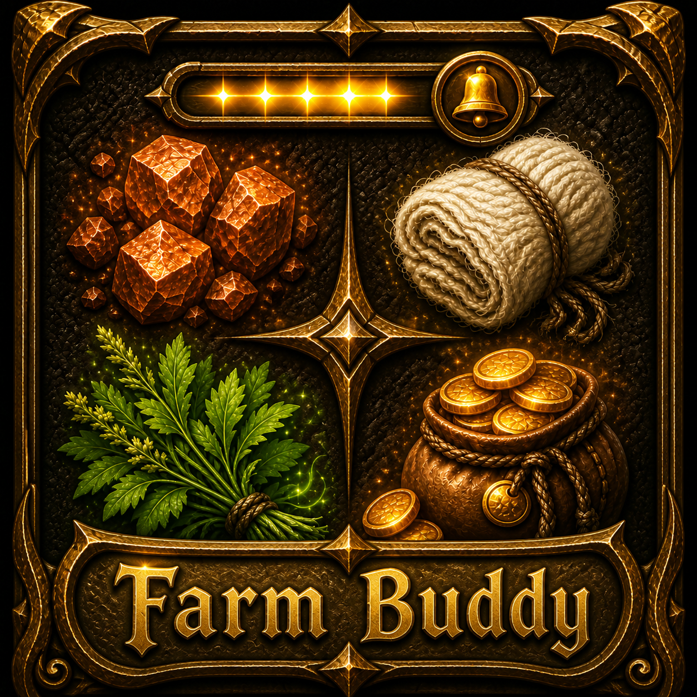

# Farm Buddy

  

A World of Warcraft AddOn that adds the functionality to Track multiple farmed items. A notification will appear if the defined goal quantity for an item has reached.

**Quickstart**  
Alt + left-click on an Item in your Bags or Bank to start tracking.
You can also enter the name of the desired Item in the AddOn settings.

**Features**  
* Track farmed Items
* Track inventory or inventory and bank quantity
* Define an optional quantity for the farmed item
* Show a bonus to your defined goal if you get more than 100% progress
* Shows a notification if the item quantity has reached
* Select an optional sound for the notification
* Customize notification effects
* Localized (English and German)
* Show a progress bar or text
* Define a shortcut for fast tracking (Default: ALT + left click)

**Please note:** Through the limitation of the API functions it is currently only possible to track known items by name. That means the items have to be in your data cache (Inventory or Bank)
If possible please use the item ID or the item link.

**Chat Commands**  
* /fbs track < Item ID | Item Name | Item Link > (< Quantity >) - Sets the tracked item.
* /fbs quantity Item ID | Item Name | Item Link < Quantity > - Sets the goal quantity.
* /fbs reset < all | items > - Resets Farm Buddy to its default settings.
* /fbs settings - Open up the AddOn settings page.
* /fbs version - Show the current used Farm Buddy Version.
* /fbs help - Shows the available chat commands.

**Bug Reports and Feature Requests**  
Please use the [CurseForge](https://wow.curseforge.com/projects/farm-buddy/issues) ticketing systems to submit bug reports and feature requests.

---
# Links
**Github:** https://github.com/KeldorDE/Farm-Buddy  
**CurseForge:** https://wow.curseforge.com/projects/farm-buddy

---
# Useful Links for Development  
**World of Warcraft Icon List:** http://www.wowhead.com/icons  
**WowAce Documentation:** https://www.wowace.com/projects/ace3/pages/  
**AddOn API Documentation:**
* http://wowwiki.wikia.com/wiki/Category:World_of_Warcraft_API
* https://wow.gamepedia.com/World_of_Warcraft_API
* https://www.townlong-yak.com/framexml/live
